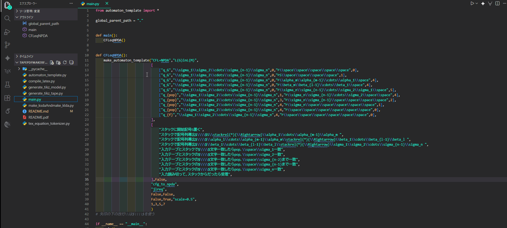
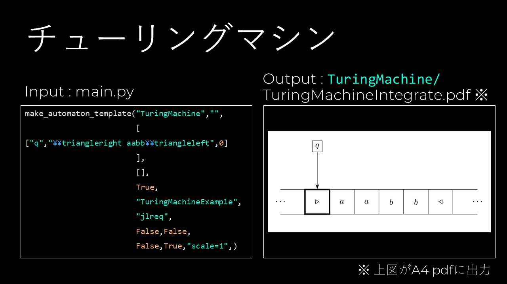
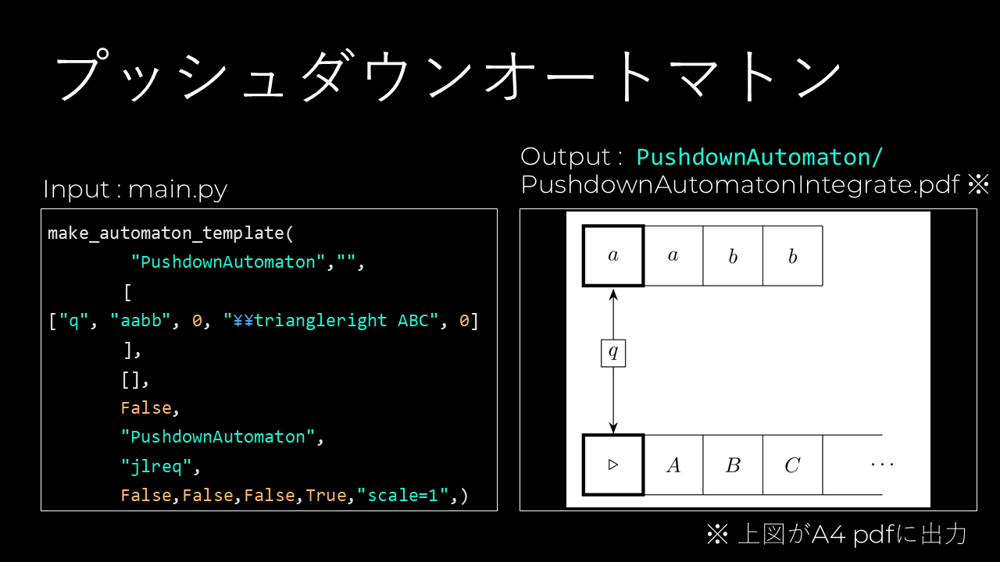

# オートマトンのテープ図作成ツール
オートマトン理論で使うテープ図のpdfファイルを作成するツールです。

元々、大学の卒業研究の合間に制作していました。


## 作成した動機
オートマトンとはテープを使って記号列を認識する計算モデルです。
そして、オートマトン理論の証明においては本来、記号列を実際に認識する過程をテープ図で示す必要があります。

しかし、学会や国際会議の論文では紙面の都合上、テープ図は省略されてしまいます。
逆に、大学の卒業論文では紙面の制約が比較的少ない事から、証明を示す際にテープ図を多く使って説明しようと考えました。

記号を1文字1文字読み取るごとにテープ図を都度作っていく事は大変である事から、
私はこの作業を自動化するためにツールを作りました。


## 使い方の例




## 必要環境
* python 3
* Microsoft製 python vscode拡張機能
* OSはなんでもいい
### texツール
* luatex
* tikz
* unicode-math
* amsfonts
* jlreq
* standalone

## 実行方法と生成ファイル確認方法
1. リポジトリをクローン．VSCodeで開き，releaseブランチに変更
2. 上記 gif のようにVSCodeでデバッグ or
ターミナルを開き，以下のコマンドを入力．
```sh
python main.py
```
すると，`CFL=NPDA`ディレクトリが作られる．その内部構成は以下の通り．
```sh
CFL=NPDA ： 親フォルダ名
└─L(G)inL(M) ： 子フォルダ名
    ├─auxs
    ├─logs
    └─output ：　オートマトンのテープ図がここに出力される！
```
4. `output`ディレクトリを開いて，`cfg_to_npdaIntegrate.pdf`を開く．
### ※`cfg_to_npdaIntegrate.pdf`の内容
プログラミング言語の文法は文脈自由文法 `cfg` によって規定されている．
`cfg`は，非決定性プッシュダウンオートマトン `npda` とが受理する記号列と，
全く同じ記号列を生成する事が知られている．[1]

[1] [『オートマトン・言語理論の基礎』 米田政明，広瀬貞樹，大里延康，大川知 著，近代科学社，(2003)](https://www.kindaikagaku.co.jp/book_list/detail/9784764902978/)


## main.pyの編集方法
main.pyで，`make_automaton_template()`関数の引数を入れる。
### テープ２本の場合
```python
make_automaton_template("親フォルダ名","子フォルダ名（いらなかったら何も書かない）",[
    ["内部状態 :str","input tapeの内容文字列 :str","input headの位置 :int ．0始まり．","storage tapeの内部文字列 :str",
    "storage headの位置 :int．0始まり．"], # 画像1枚目
    ["内部状態 :str","input tapeの内容文字列 :str","input headの位置 :int ．0始まり．","storage tapeの内部文字列 :str",
    "storage headの位置 :int．0始まり．"], # 画像2枚目
    ["内部状態 :str","input tapeの内容文字列 :str","input headの位置 :int ．0始まり．","storage tapeの内部文字列 :str",
    "storage headの位置 :int．0始まり．"], # 画像3枚目

    # .. 4枚目以降も可能．
],
[
    "画像1枚目から2枚目に遷移する時，矢印の下に書く註釈テキスト",
    "画像2枚目から3枚目に遷移する時，矢印の下に書く註釈テキスト",
    # .. 3枚目以降も可能．
],
"テープは1本(fa)か2本 (pda)か :bool (True:1本 or False：2本)"⇒False,
"画像のファイル名 :str",
"jlreq or standalone  :str",
"画像を1枚ずつ作るかどうか :bool (True：作る or False：作らない)",
"画像を矢印でつないだファイル作るかどうか :bool (True：作る or False：作らない)",,
"画像を矢印でつなぎ，さらに見切れないよう以下の引数で調整したファイル作る時，個別のファイルを作るかどうか :bool (True：作る or False：作らない)",
"画像を矢印でつなぎ，さらに見切れないよう以下の引数で調整したファイル作るかどうか :bool (True：作る or False：作らない)",,
"standalone option． 上のboolがFalseだと効果なし :str",
"画像を何枚目で改行するか：, , , , ,... :intの可変長引数．0始まり． !最後の画像の数を描くと0徐算エラーになるので注意! ")
```
### テープ１本の場合
```python
make_automaton_template("親フォルダ名","子フォルダ名（いらなかったら何も書かない）",[
    ["内部状態 :str","storage tapeの内容文字列 :str","input headの位置 :int ．0始まり．"], # 画像1枚目
    ["内部状態 :str","storage tapeの内容文字列 :str","input headの位置 :int ．0始まり．"], # 画像2枚目
    ["内部状態 :str","storage tapeの内容文字列 :str","input headの位置 :int ．0始まり．"], # 画像3枚目
    # .. 4枚目以降も可能．
],
[
    "画像1枚目から2枚目に遷移する時，矢印の下に書く註釈テキスト",
    "画像2枚目から3枚目に遷移する時，矢印の下に書く註釈テキスト",
    # .. 3枚目以降も可能．
],
"テープは1本(fa)か2本 (pda)か :bool (True:1本 or False：2本)"⇒True,
"画像のファイル名 :str",
"jlreq or standalone  :str",
"画像を1枚ずつ作るかどうか :bool (True：作る or False：作らない)",
"画像を矢印でつないだファイル作るかどうか :bool (True：作る or False：作らない)",,
"画像を矢印でつなぎ，さらに見切れないよう以下の引数で調整したファイル作る時，個別のファイルを作るかどうか :bool (True：作る or False：作らない)",
"画像を矢印でつなぎ，さらに見切れないよう以下の引数で調整したファイル作るかどうか :bool (True：作る or False：作らない)",,
"standalone option． 上のboolがFalseだと効果なし :str",
"画像を何枚目で改行するか：, , , , ,... :intの可変長引数．0始まり． !最後の画像の数を描くと0徐算エラーになるので注意! ")

```
### 注意
tex記法で変更していくが、以下の点には注意。
* `\`から始まる文字やコマンドは`\\`から始める。
    * 例：ギリシャ文字のγである`\gamma`は`\\gamma`、σである`\sigma`は`\\sigma`と入力。
    * 例：半角シャープ#は`\\#`と入力。
* uppertrackとlowertrackの表記は、`[^{上側文字}_{下側文字}]`と書く。
    * 例：：上にσ、下にγと書きたいときは`[^{\\sigma}_{\\gamma}]`と書く。
* `$\\\\$$aiueo`は`$\\\\aiueo`に省略可能
* 添字倍加機能は添字部分に中括弧{}がないといけない


### エラーでた時の対処法
#### index out of range
* オートマトンの画像情報は二次元配列になっている．1次元配列で書いていないか確認
* tape2とtape1で二次元配列の項目が違うことに注意．
* 画像と画像を結ぶ矢印のテキスト書く所は一次元配列．かつ，必ず画像枚数分要素数が必要! 記入漏れはある？
#### undefined control sequence
* 例えば`\\sigma`とか，スラッシュの後の文字書いた後は半角空白が必要．`\\simga上の`とかだとエラーになる．`\\sigma 上の`と書く必要あり．
#### ! Package graphics Error: Division by 0.
* テープ図の分割ミス

#### Extra `}`, or forgotten $.
* このエラーが出ている上のファイル名をクリックして、baselineが入っているtikzpicture環境を見ると、そこから下のコードの色合いが変になっている。適切な場所に`}`を入れると、解決
#### error:  (file rm-lmr10) (type 3): font rm-lmr10 at 600 not found
→texliveが正しくインストールされてない可能性あり
* [参考リンク1](https://qiita.com/Shiccho/items/e3d707f07fa23f1e74d0)
* [参考リンク2](https://qiita.com/kk0128/items/8c567c0aad0623eb7627)
* [参考リンク3](https://qiita.com/jizo/items/9496496a3156dd39d91a)
<!-- ## 今後修正予定
* uppertrackとlowertrackの表記と、`{}`を使った添え字表記の組み合わせが非対応。
    * `{}`なしの添え字は使える。例えば`[^{\\sigma_1}_{\\gamma_1}]`とか。
    * また、上付き添え字と下付き添え字をupper,lowertrackで同時に使用するとでかくなりすぎる。
* pgf manualの2.6 Rectangle Path Construction
* 太字などはunicode-mathライブラリの`symbf` などを使う。
    * 参考：[徹底解説！ unicode-mathパッケージでココが変わる](https://qiita.com/zr_tex8r/items/648b024e55126f3ba077)
```tex
\begin{tikzpicture}
    \draw (-1.5,0) -- (1.5,0);
    \draw (0,-1.5) -- (0,1.5);
    \draw (0,0) circle [radius=1cm];
    \draw (0,0) rectangle (0.5,0.5);
    \draw (-0.5,-0.5) rectangle (-1,-1);
\end{tikzpicture}
```
これ使ってセル描画コードを少なくできるかも？ -->


## 元ネタ
[pzuehlke/Turing-machine-tape-generator](https://github.com/pzuehlke/Turing-machine-tape-generator)のコードを一部改変したのが本作。
